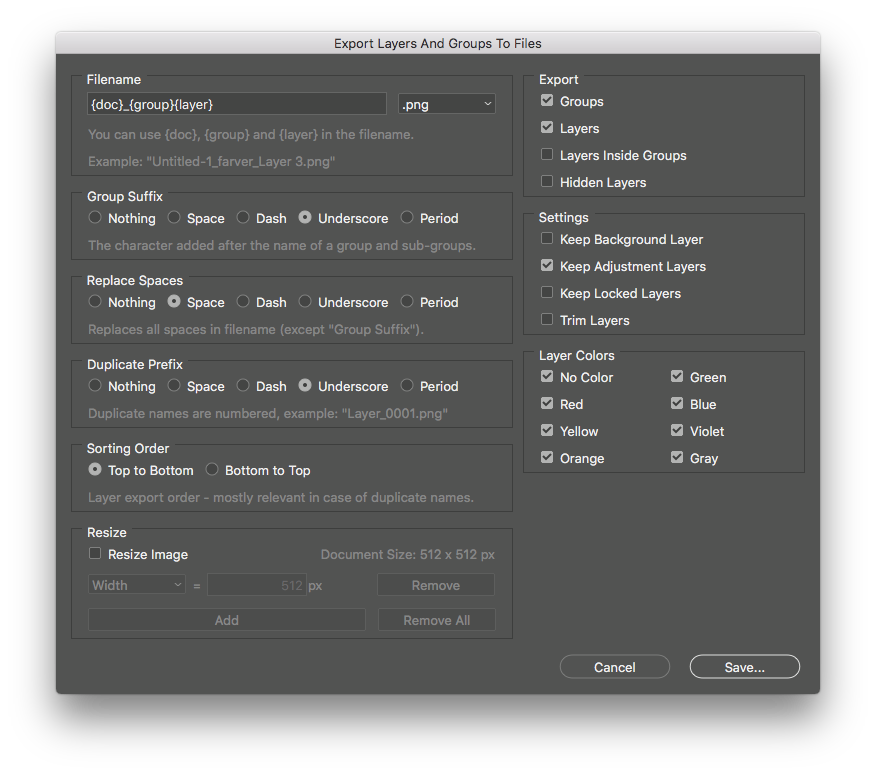

# Export Layers And Groups To Files

Photoshop script for exporting layers and/or groups to separate files.

Download [Export Layers And Groups To Files.jsx](https://github.com/mortenblaa/photoshop-scripts/raw/master/Export%20Layers%20And%20Groups%20To%20Files/Export%20Layers%20And%20Groups%20To%20Files.jsx) and copy it to the Photoshop scripts folder. Alternatively you can open it in Photoshop using File > Scripts > Browse...

Tested with Photoshop CC 2020.

## Features

- Different output formats (PNG, JPG, TIFF, PSD) depending on document bit depth
- Option to only export groups or layers
- Export of layers/group with certain color tags
- Child layers
- Include hidden layers
- Keeping adjustment layers visible
- Trimming of layers
- Does not export empty groups

## Options

### Filename

The filename is defined as a mix of a custom name together with tags that inserts parts of the document name. You should at the very least include the `{layer}` tag to ensure unique naming of the output files.

| Tag | Replacement |
| :--- | :--- |
| `{doc}` | Inserts the document name into the filename |
| `{group}` | Inserts the name(s) of the parent groups, divided by the **Group Suffix** |
| `{layer}` | Inserts the layer or group name that is currently being exported |

Example: 

`Hero_{group}{layer}` would become `Hero_FaceEyes`.

### File Format

The output file format. The available options are dependent on the documents bit depth and color mode.

- All formats include transparency, except for JPG and PDF files.
- JPG files are set to a quality level of 10.
- Photoshop and TIFF files are exported without layers.
- PDF files don't downsample and are saved with a JPG quality level of 10.
- GIF files uses the "Local Selective" palette type and diffusion type dithering.

| Color Mode and Bit Depth | PNG  | JPG  | GIF  | TIFF | PSD  | PDF  |
| :---                     | :--: | :--: | :--: | :--: | :--: | :--: |
| RGB 8-bit                | X    | X    | X    | X    | X    | X    |
| RGB 16-bit               | X    | X    |      | X    | X    | X    |
| RGB 32-bit               |      |      |      | X    | X    |      |
| CMYK 8-bit               |      | X    |      | X    | X    | X    |
| CMYK 16-bit              |      | X    |      | X    | X    | X    |
| LAB 8-bit                |      |      |      | X    | X    | X    |
| LAB 16-bit               |      |      |      | X    | X    | X    |
| Grayscale 8-bit          | X    | X    | X    | X    | X    | X    |
| Grayscale 16-bit         | X    | X    |      | X    | X    | X    |
| Grayscale 32-bit         |      |      |      | X    | X    |      |
| Indexed Color            | X    |      | X    | X    | X    | X    |
| Bitmap                   | X    |      | X    | X    | X    | X    |

### Group Suffix

Optional character that is put after each group name.

### Numbering Prefix

Optional character that is put before number. 

Note: A 4-digit number is added after the filename in case of name clashes. So if the final name would be "MyLayer", the next layer with the same would be "MyLayer_0001".

### Sorting Order

The order layers are processed. Either from **Top to Bottom** or **Bottom to Top** as seen in Layers panel. 

### Export Layers

Will include layers in the export.

### Export Groups

Will include groups in the export.

### Child Layers

If enabled, the script will export layers in groups and sub-groups separately. Otherwise only top-level layers and groups are exported.

Tip: Use it together with layer colors to specify which layers/group should be exported.

### Hidden Layers (With Layer Color)

Will make hidden layers visible and export them, if they have one of selected layer colors.

### Keep Background Layer

If enabled, will leave the **Background** layer visible and not export it separately. Otherwise the **Background** layer is hidden and exported separately - depending on whether it is visible and other preferences, like **Layer Colors**.

### Keep Adjustment Layers Visible

Keeps **Adjustment Layers** visible so they still affect the layers being exported. Useful to keep overall adjustment on all layers.

### Keep Pixel Locked Layers Visible

Keeps **Pixel Locked** (including generally locked) layers visible on all exported layers. This is, for example, useful if you have a watermark that you want to remain visible on each exported layer.

### Trim

Trim the image (remove transparent pixels) before exporting.

### Layer Colors

Only layers and groups with the specified layer color(s) are exported. This is especially useful when mixed with the **Hidden Layers** option.

### Verify Overwrite

Performs a test run prior to saving any files, and warns you if one or more files will be overwritten.

If you have many layers, and don't care about the added safety, you can disable this for a small performance gain.
