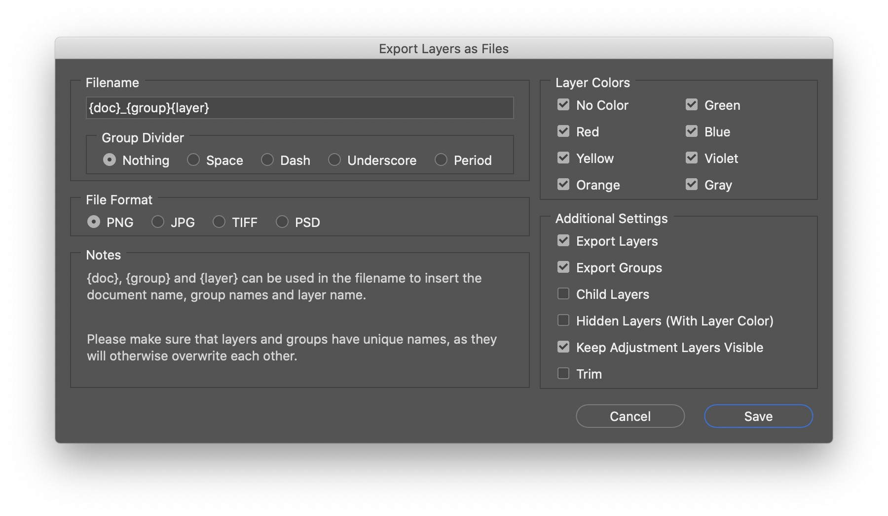

# Export Layers As Files

Photoshop script for exporting layers and/or groups to separate files.

Tested with Photoshop CC 2020.

## Features

- Different output formats (PNG, JPG, TIFF, PSD) depending on document bit depth
- Option to only export groups or layers
- Export of layers/group with certain color tags
- Child layers
- Include hidden layers
- Keeping adjustment layers visible
- Trimming of layers

## Options

### Filename

The filename is defined as a mix of a custom name together with tags that inserts parts of the document name. You should at the very least include the `{layer}` tag to ensure unique naming of the output files.

| Tag | Replacement |
| :--- | :--- |
| `{doc}` | Inserts the document name into the filename |
| `{group}` | Inserts the name(s) of the parent groups, divided by the **Group Divider** |
| `{layer}` | Inserts the layer or group name that is currently being exported |

Examples: `Hero_{group}{layer}` would become `Hero_FaceEyes`.

With the **Group Divider** set to `Underscore` the above example would output `Hero_Face_Eyes`.

### File Format

The output file format. The available options are dependent on the documents bit depth.

- For 32-bit documents, only PSD and TIFF are available.
- All formats include transparency, except for JPG files.
- JPG files are set to a quality level of 10.

Note that Photoshop and TIFF files are exported without layers.

### Layer Colors

Only layers and groups with the specified layer color(s) are exported. This is especially useful when mixed with the **Hidden Layers** option.

### Export Layers

Will include layers in the export.

### Export Groups

Will include groups in the export.

### Child Layers

If enabled, the script will export layers in groups and sub-groups separately. Otherwise only top-level layers and groups are exported.

Tip: Use it together with layer colors to specify which layers/group should be exported.

### Hidden Layers (With Layer Color)

Will make hidden layers visible and export them, if they have one of selected layer colors.

### Keep Adjustment Layers Visible

Will leave Adjustment Layers visible so they still affect the layers being exported. Useful to keep overall adjustment on all layers.

### Trim

Trim the image (remove transparent pixels) before exporting.
